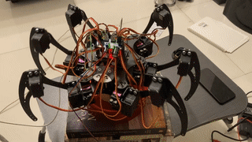

# Six legged robot MALAYAN

A ROS2-based autonomous hexapod robot designed for search and rescue operations in disaster scenarios. The robot utilizes advanced sensing and navigation capabilities to locate survivors in challenging environments.

## Features

- Autonomous navigation using sensor fusion and A* path planning
- Human detection using night vision camera and OpenCV-based machine learning
- Real-time mapping and obstacle avoidance through LiDAR scanning
- GPS-based positioning with continuous tracking and location publishing
- Comprehensive failsafe mechanisms for robust operation
- Manual override capabilities through base station control

## Hardware Specifications

### Robot Platform
- 6-legged design with 18 degrees of freedom
  - 3 HS 995MG servo motors per leg (hip, knee, ankle joints)
  - Tripod gait implementation for stable movement
- Raspberry Pi 4B running Ubuntu and ROS2
- RPLiDAR A1 for 360° obstacle detection and mapping
- NEO-6M GPS module for global positioning
- M5Stack 6-Axis IMU (MPU6886) for orientation and stability
- Night Vision Camera (Raspberry Pi Camera Module with IR-CUT)
- PCA9685 servo controller for precise motor control

## System Architecture

### Package Structure
```
hexapod_ws/
├── src/
    ├── hexapod_interfaces/       # Custom messages and services
    ├── hexapod_hardware/         # Hardware interfaces
    ├── hexapod_control/          # Control system
    ├── hexapod_perception/       # Perception system
    └── hexapod_bringup/         # Launch files
```

## Core Packages

### hexapod_interfaces
Custom messages and services for system communication:
- JointCommand.msg: Servo motor position and velocity commands
- RobotState.msg: Current robot status and sensor data
- HealthStatus.msg: System diagnostics and component status
- DetectionResult.msg: Human detection results with GPS coordinates
- Services for mode switching and emergency procedures

### hexapod_hardware
Hardware abstraction layer managing all physical components:
- Servo controller for coordinated leg movement
- IMU interface for orientation and stability control
- GPS interface for position tracking and navigation
- LiDAR interface for environment mapping
- Camera interface for vision processing

### hexapod_control
Core control systems implementing robot behavior:
- Hierarchical state machine managing overall robot behavior
- PID controller for maintaining stability during movement
- Tripod gait controller for efficient locomotion
- A* path planning with obstacle avoidance
- Motion planning and execution system

### hexapod_perception
Sensor processing and environmental understanding:
- Sensor fusion combining LiDAR and GPS data
- Real-time map generation and updating
- OpenCV-based human detection system
- Health monitoring and diagnostics
- Base station communication handler

## Dependencies

- Ubuntu 22.04 LTS (Operating System)
- ROS2 Humble (Robotics Framework)
- Python 3.8+ (For perception algorithms)
- OpenCV 4.x (Vision processing)
- Required ROS2 packages:
  - rclcpp: C++ client library
  - rclpy: Python client library
  - sensor_msgs: Sensor data message types
  - geometry_msgs: Geometric data types
  - nav_msgs: Navigation messages
  - vision_msgs: Computer vision messages

## Installation

1. Create workspace:
```bash
mkdir -p ~/hexapod_ws/src
cd ~/hexapod_ws/src
```

2. Clone repository:
```bash
git clone https://github.com/username/hexapod-robot.git .
```

3. Install dependencies and build:
```bash
cd ~/hexapod_ws
rosdep install --from-paths src --ignore-src -r -y
colcon build
```

## Usage

1. Source workspace:
```bash
source ~/hexapod_ws/install/setup.bash
```

2. Launch options:
```bash
# Complete system
ros2 launch hexapod_bringup complete_robot.launch.py

# Hardware only (for testing sensors and actuators)
ros2 launch hexapod_bringup hardware.launch.py

# Control system (for testing navigation and planning)
ros2 launch hexapod_bringup control.launch.py
```

## Safety Features

Comprehensive safety system with multiple fallback mechanisms:

### Signal Monitoring
- Continuous signal strength monitoring
- Warning alert at 70% signal strength
- Automatic fallback procedures at 50% signal strength
- Return to last known safe position when signal is compromised

### Fault Detection
- Stuck detection system (45-second threshold)
- Component failure monitoring
- Automatic mode switching to manual control
- Return-to-home capability

### Emergency Procedures
- Emergency stop functionality
- Automatic failure reporting to base station
- Position tracking every 5 seconds
- Manual override capability

## License

Distributed under the MIT License. See `LICENSE` for more information.


