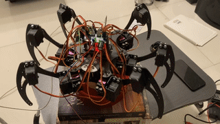

# Six legged robot MALAYAN

## Overview

This project involves creating a six-legged hexapod robot with advanced features including obstacle avoidance, human detection, path planning, and camera control. The robot uses ROS 2 for control and communication and integrates various sensors and actuators for its functionalities.

## Components

- **Hexapod Robot**: Equipped with 18 servo motors (3 per leg) and an additional servo for camera movement.
- **Sensors**: 
  - Pi Camera for human detection.
  - YDLIDAR X2 360 Degree ROS Scanner for navigation.
- **Actuators**: HS 995MG servo motors for leg movements and camera adjustment.
- **Controller**: Raspberry Pi 4 for processing and control.

## Packages

### 1. `hexapod_control_pkg`
Contains:
- `gait_controller.py`: Manages hexapod gait and movements.
- `servo_controller.py`: Controls servo motors.

### 2. `perception_pkg`
Contains:
- `human_detection_node.py`: Detects humans using the Pi Camera. (This havent implemented yet)
- `lidar_processing_node.py`: Processes LiDAR data for obstacle detection and navigation.

### 3. `navigation_pkg`
Contains:
- `path_planning.py`: Implements path planning using the RRT algorithm.
- `obstacle_avoidance.py`: Handles obstacle avoidance using LiDAR data.

### 4. `camera_servo_control_pkg`
Contains:
- `camera_servo_node.py`: Controls the camera servo motor for manual adjustment.

### 5. `integration_pkg`
Contains:
- `master_node.py`: Integrates various functionalities, including joystick control and human detection.

## Launch File

`hexa_malayan.launch.py `- Launches all necessary nodes for the robot operation. 

## Usage
1. Build the Project:
   ```
   colcon build
   ```
2. Source the Workspace:
   ```
   source ~/.bashrc
   ```
3. Launch the Robot:
  ```
  ros2 launch my_robot_bringup hexa_malayan.launch.py
  ```
4. Control the Robot:
    -Use joystick input to camera.
    -Monitor human detection and navigation feedback through ROS 2 topics and actions.

## Dependencies
- ROS 2 Humble
- Python 3
- Required Python packages: `numpy`, `scipy`, `opencv-python`, etc.

## License
This project is licensed under the MIT License - see the [LICENSE](LICENSE) file for details.



